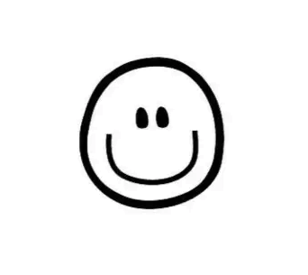

<!-- _coverpage.md -->

# 一款电脑终端神器

    网页
    视频
    单机游戏
    网络游戏
    电脑应用
    活动资讯
    游戏软件

> 💪使用Keyboard + Mouse让复杂的操作简单化

- 简单、轻便 (1~20mB)
- 无需安装丨绿色安全丨即开即用

>>>>
- <small>版本号：v6.0 ，更新时间：2023-6-27</small>

[开始使用 Let Go](/README.md)

